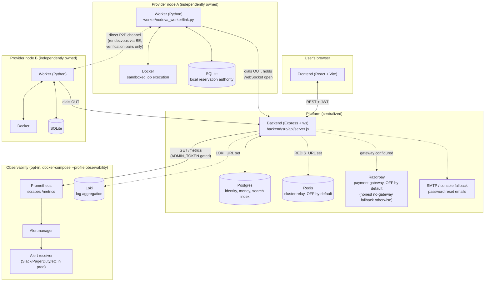

# Architecture

This is a map of the moving pieces and how they actually talk to each
other today -- not an aspirational diagram of where the project might go.
See the README's own "Architecture, stated honestly" section for the
one-sentence version of the claim this diagram backs up: **compute and
marketplace coordination are distributed across independently owned
nodes; identity and money are not.**

## Component diagram



Dotted lines are off by default and only activate when the relevant env
var is set -- the same posture every one of them was built with
(`REDIS_URL`, `RAZORPAY_KEY_ID`/`SECRET`, `SMTP_HOST`/etc, `LOKI_URL`, the
worker-to-worker peer channel needing `peer_port` configured on both
sides). A single-instance deployment with no payment gateway and no
observability profile enabled -- the default -- never touches any of them.

## The one idea everything else follows from

**The provider node, not the central scheduler, is authoritative over its
own hardware.** Postgres is a search index over what nodes CLAIM, not a
record of what's true. Nothing is promised to a user without a signed
receipt from the node itself (`docs/reservation-protocol.md`). This is why:

- The worker dials OUT and the platform never opens a socket to a node
  (`backend/src/ws/protocol.js`'s file header) -- most consumer GPUs sit
  behind NAT and can't accept an inbound connection, so the whole protocol
  is designed around a connection the node initiates and holds open.
- The reservation lock happens on the node FIRST, money moves SECOND
  (`docs/reservation-protocol.md`'s "Ordering rule") -- a lost lock costs a
  provider an idle hour; a lost payment costs a user real money and a
  support ticket.
- Job execution results are self-reported by the node, which is exactly
  why duplicate-execution verification (`docs/security-model.md`'s
  Direction 2, `backend/src/jobs/verification.js`) exists: a single node's
  claim about its own job's outcome is not independently checkable any
  other way.

## Request flows

### Booking + payment (the happy path)

```
user -> POST /search          -> Postgres (index of node claims + live availability)
user -> POST /reservations    -> BE -> RESERVE_REQUEST -> node (WS)
                                     node signs a RECEIPT, BE verifies it
                                     status: pending -> held
user -> POST /reservations/:id/confirm
                                -> BE captures payment (Razorpay, or the
                                   honest no-gateway fallback if unconfigured)
                                -> status: held -> confirmed
                                -> RESERVE_COMMIT -> node (lock made permanent)
user -> POST /reservations/:id/jobs
                                -> JOB_SUBMIT -> node -> real Docker container
                                node -> JOB_RESULT (async, may be hours later)
                                -> BE settles the reservation (ledger entries,
                                   provider payout, reputation update)
```

Full detail, including every failure mode this handles (lost
RESERVE_COMMIT ack, an expired hold, a node that goes offline mid-job): see
`docs/reservation-protocol.md`.

### Duplicate-execution verification + dispute resolution

```
user submits a job with verify_against_reservation_id (a second,
separately booked reservation on a DIFFERENT node)
  -> both nodes run the IDENTICAL job
  -> BE compares each node's self-reported result_hash
     match     -> both reservations settle normally
     mismatch  -> both reservations move to 'disputed', BOTH refunded in
                  full (the money question is answered immediately and
                  honestly: "we don't know who's right, so no one is
                  charged") -- see docs/security-model.md
  -> optionally, a THIRD independently-booked node runs the same job as a
     tiebreaker (majority vote) for REPUTATION attribution only; the
     refund already happened and is never revisited
```

The honest limit stated up front in `verification.js`'s own file header: a
mismatch proves at least one node is wrong, never which, and a MATCH is
proof of agreement, not proof of correctness -- two colluding nodes pass
cleanly. This raises the cost of cheating; it doesn't eliminate it.

### P2P discovery (Phase 2, started)

```
BE pairs two nodes for verification
  -> BE pushes each node a PEER_INFO about the other: identity (public
     key) + a dialable address BE itself observed (never self-reported)
  -> if both nodes opted into a local peer listener, they open a direct,
     mutually-authenticated TCP connection to each other, reusing the
     SAME Ed25519 identity each already registered with the platform
```

What this solves: discovery and a real direct channel for nodes that are
actually reachable. What it does NOT solve: NAT traversal -- a node behind
a typical home/office NAT with no port forwarding still can't accept a
direct inbound connection, the same reason the platform itself never
could. See `docs/reservation-protocol.md`'s "what is NOT solved yet" and
`worker/nodeva_worker/peer.py`'s file header.

## Data authority, at a glance

| Data | Lives in | Authoritative? |
|---|---|---|
| User identity, passwords, sessions | Postgres | Yes |
| Money: ledger, payments, refunds | Postgres | Yes |
| A node's CLAIMED hardware specs | Postgres | No -- self-reported, cross-checked against heartbeats (honesty check, not a security control; see `worker/nodeva_worker/hardware.py`) |
| Whether a specific slot is booked | The NODE's own SQLite, mirrored into Postgres | The node's local state is what a signed RECEIPT actually attests to; Postgres is reconciled against it (`docs/reservation-protocol.md`'s failure matrix) |
| A job's actual output | The node that ran it | Self-reported; verification (above) is the only cross-check that exists |
| Metrics/logs | Prometheus / Loki (opt-in) | N/A -- observability data, not source of truth for anything |

## Where to read more

- `docs/reservation-protocol.md` -- the booking/payment ordering and every
  failure mode it defends against.
- `docs/security-model.md` -- the two threat directions (a malicious
  image, a lying provider) and what does and doesn't defend against each.
- `docs/payment-architecture.md` -- why there's no blockchain, and how the
  honest no-gateway fallback works.
- `docs/backup-restore.md`, `docs/secrets-rotation.md` -- operational
  runbooks, including their own honestly-stated gaps.
- `CONTRIBUTING.md` -- how to get a dev environment running and what this
  project actually expects of a change before it's considered done.
